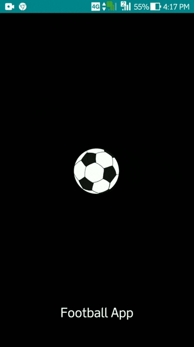

# Football Fav App
App for your own by personalizing your favorite football teams to see their latest info and one-click access to their page. Implementing PWA characteristics such as shell apps, offline capability, push notification, and installable web apps.

### Mealzy App made with:
> - Progressive Web Apps (PWA)
> - API https://www.football-data.org/
> - Indexed DB
> - Push Notification (Firebase Cloud Messaging)
> - Service Worker (Workbox Precaching)
> - Add to homescreen
> - Splash Screen
> - Materialize CSS

### Tools used:
> - Text Editor VSCode
> - Google Chrome Web Browser.
> - Web Server for Chrome.

### Football Fav App

### Hosting URL
> https://football-fav-app.web.app

### Github Pages
> https://github.com/mauraqp/mauraqp.github.io

### The following materials studied to build this app :
- **Promises and Fetch** : A modern API that we can use to write code blocks more easily and intuitively.
- **Service Worker** : JavaScript that the browser runs in the background, which is separate from other code on the browser's web page. By using a service worker, we can take advantage of the cached resources to be rendered back even in offline network mode.
- **Application Shell** : An application interface framework built by several page components and other assets. It is stored first in the cache so that it can appear instantly when the application is opened.
- **API Cache** : The cache is separate from the regular cache which is maintained by the browser. This type of cache can be used to store resources and reuse them even in offline network mode via a service worker.
- **Indexed DB** : NoSQL based local storage system in the browser. We can store any data in the user's browser for application purposes. You can perform data search, update and delete actions.
- **Web Push** : API that can receive notification messages from servers in the background. Web Push can be combined with a notification system, namely pop-up messages that appear on the user's device. The PWA application can receive push events and display pop-up messages even if the user is not opening the application.
- **Workbox** : A collection of libraries and tools that we can use to generate service worker files, precaching, routing and runtime-caching. Workbox makes it easy for us to write PWA code with a simpler and easier to manage syntax.

_This class thoroughly discusses the components needed to implement Progressive Web Apps such as the App Shell, Service Worker, Web Push, and Web Apps Manifest. Compiled and verified by Codepolitan as our partner in developing the academy, the material presented is structured and comprehensive._
**[Dicoding PWA](https://www.dicoding.com/academies/74)**
